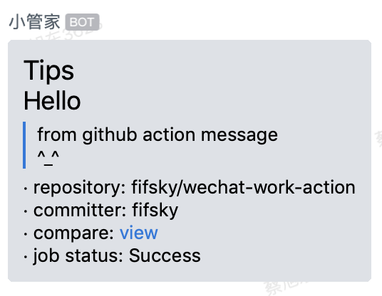

# Wechat-Work robot action


Github action for sending Wechat-Work robot messages

## ✨ Example Usage

```yml
- name: wechat-work robot message
uses: fifsky/wechat-work-action@master
with:
  url: ${{ secrets.WECHATWORK_WEBHOOK}}
  type: markdown
  content: |
    # Tips
    ## Hello
    > from github action message
    > ^_^
```

🔐 Set your secrets here: `https://github.com/USERNAME/REPO/settings/secrets`.

**Result**



## Options

| option | type | required | default | description |
| --- | --- | --- | --- | --- |
|  url | string | Yes | none | The full address of webhook: https://qyapi.weixin.qq.com/cgi-bin/webhook/send?key=xxxxxx |
| type | string | No | text | message type，support (text,markdown,custom) |
| content | string | Yes | none |  Message content, text or markdown or json string |
| at | string | No | none | At user,Use commas to separate, for example: 13812345678,13898754321 or all |

if type is custom, content is wecaht-work api json request body,for example

> content: {"msgtype": "text", "text": {"content": "我就是我, 是不一样的烟火"}}
